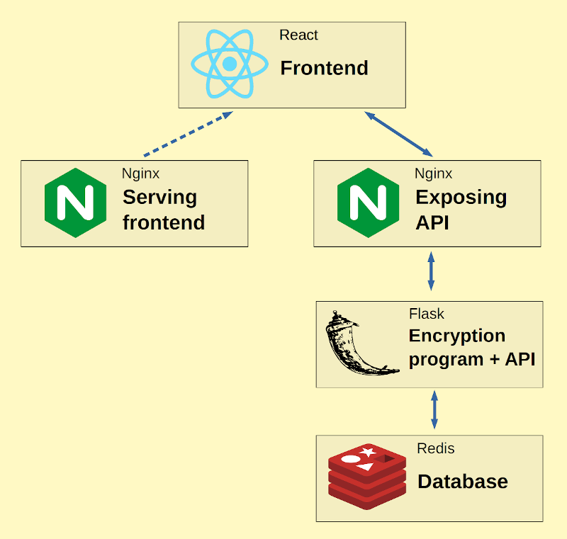

# 🔒 Safe Secrets

**Personal note** _I used this project to learn my self container orchestration trough Kubernetes. I also used it to learn other skills concerning robust full-stack applications._

The application lets you save your secrets safely by encrypting them. Below is an owerview of how it works.

Here is the flow of the application:

### Backend

It's made with Flask in Python. It uses the encryption library Fernet that encrypts using AES (Advanced Encryption Standard). The password provided by the user is hashed using SHA256 which Fernet will accept as a key.
The API uses Gunicorn as a WSGI which is exposed by Nginx.

### Frontend

The frontend is made with React and Next.js. It is written in TypeScript. The frontend allows for easy interaction with the backend, so that users can save and retrieve secrets. The final result when building the frontend, is a small Apline Docker image that contains the HTML, CSS and JavaScript assets

### Database

It's made with Redis. The setup uses 1 master and 2 slaves and is created using a StatefulSet. There is also another StatefulSet that creates 3 sentinels to trigger a failover if the master fails. Both kinds of pods in the StatefulSets needed special Shell scripts to find the master when initializing.
Both RDB and AOF persistence is enabled.

### Monitoring

The monitoring system uses Prometheus. To automate the configuration process it uses the Prometheus operator, so that Prometheus can find things to monitor using the ServiceMonitior. Much of the YAML is taken from the official kube-prometheus repositories manifests directory.

Things that are monitored are:
- The Prometheus instance itself
- A node-exporter for the nodes the cluster is hosted on
- Kubernetes metrics from the api server, kubelet and kube-state-metrics
- The encryption program

# License

This project is licensed under the MIT License - see the [LICENSE](LICENSE) file for details
